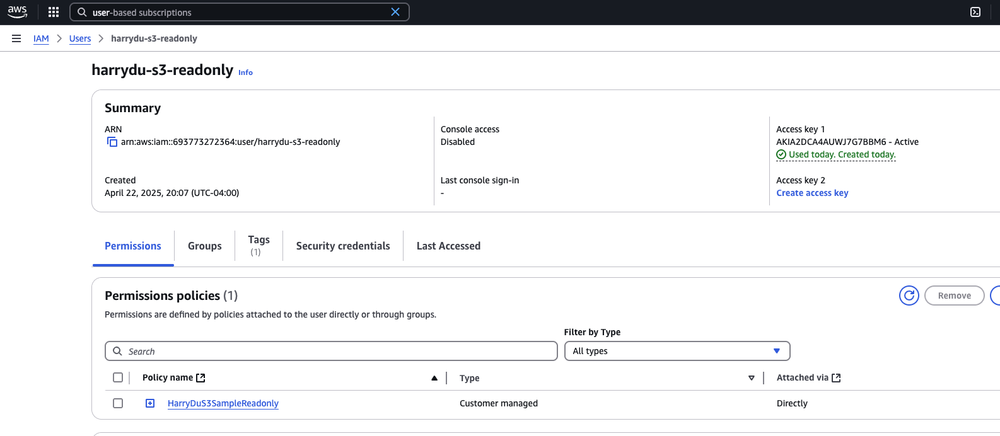
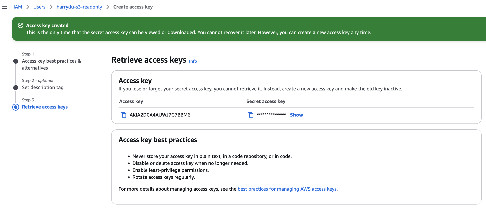

# Ingestion from S3

## Introduction
In this example, we show how to ingest from S3 using Auto Loader in Spark and DLT. 

## Instruction

Steps: 

1. Having the data in S3. 
2. Create IAM user with policy can only read the specifc S3 bucket

    Example Policy
    ```
    {
      "Version": "2012-10-17",
      "Statement": [
          {
              "Sid": "HarryDuS3SampleReadonly",
              "Effect": "Allow",
              "Action": [
                  "s3:GetObject",
                  "s3:ListBucket"
              ],
              "Resource": [
                  "arn:aws:s3:::harrydu-sample-data2",
                  "arn:aws:s3:::harrydu-sample-data2/*"
              ]
          }
      ]
    }
    ```
  

3. Create Access Key under the IAM user. (Access Key ID and the Secret Key)
  

4. Put the Access Key ID and Secret Key in Databricks in Databricks CLI

  ```
  databricks secrets put-secret db-field-eng harrydu_sample_data_s3_aws_access_key
  ```
  It will prompt you to enter the value

  ```
  databricks secrets put-secret db-field-eng harrydu_sample_data_s3_aws_secret_key
  ```
  It will prompt you to enter the value

5.  In your Databricks code, load the secrets and use save the secrets in configuration. 

## Files

- `transformations`: The DLT code for the pipeline
- `1. Spark Example`: The notebook for loading the S3 data in spark


